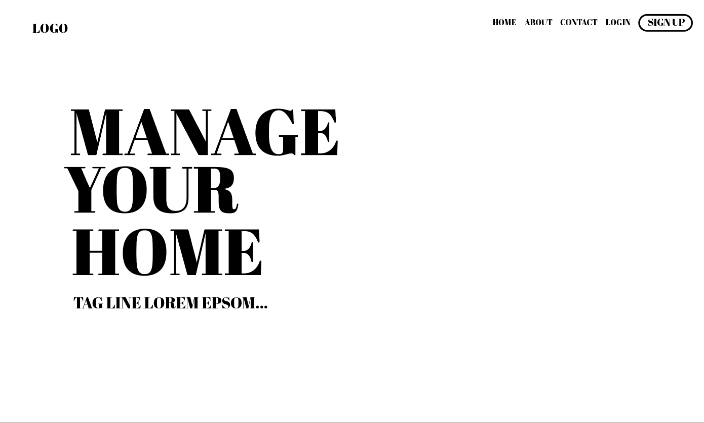
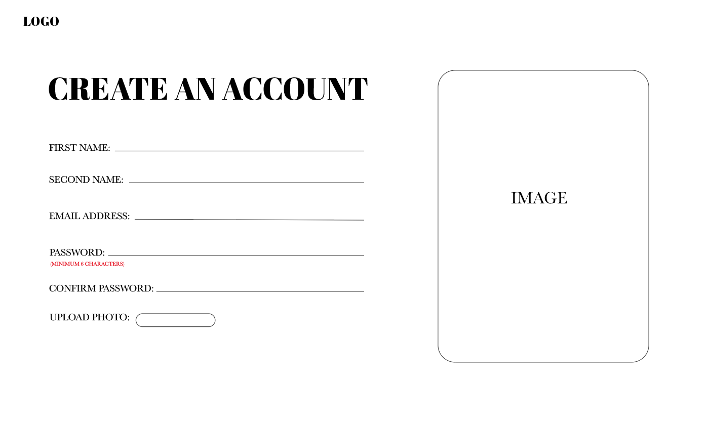
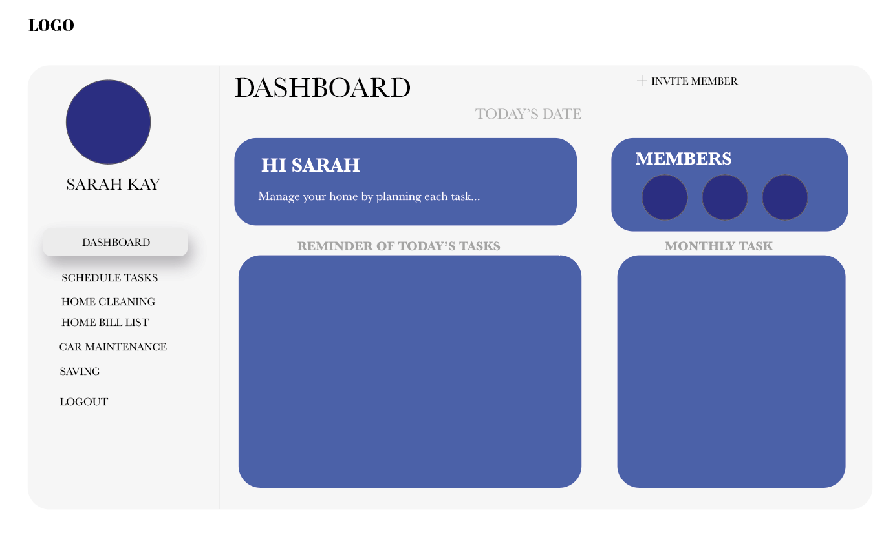
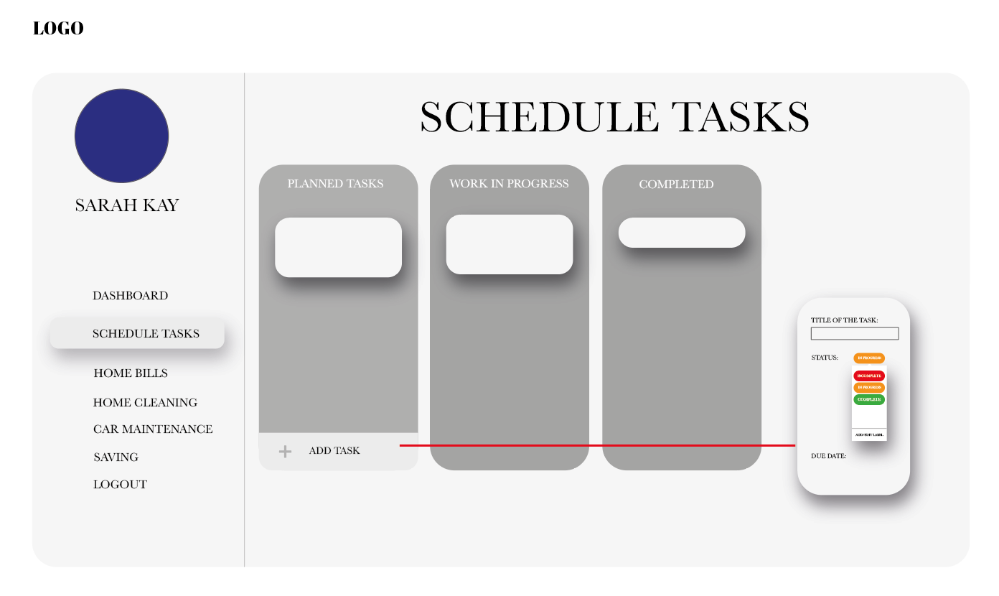
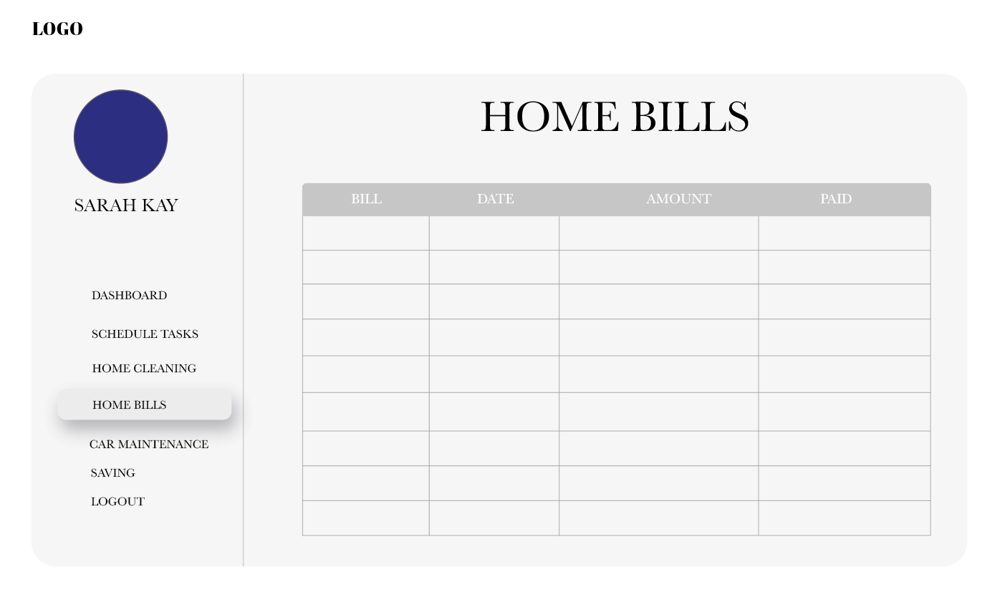
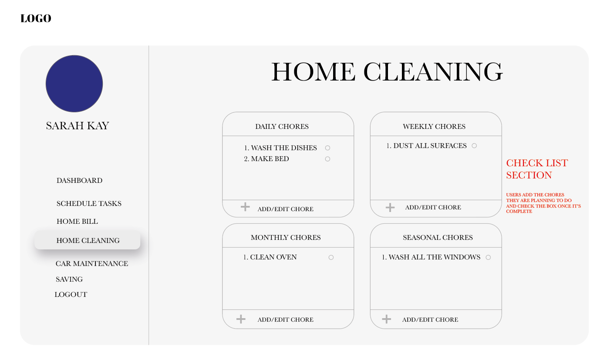

# Sorted

## Description

This application is a household management application that will generate the jobs that you need to do TODAY. 

#### User Story : 
**AS:** A busy working adult. 

**I WANT:** An application to manage my task and jobs list around my schedule.

**TO:** Keep me organized and on top of everyday and long-term tasks.

#### Reasoning : 
With everything that a household requires to run effectively for a family or individual, jobs can become quite overwhelming and its often difficult to know where to start. 

Sorted Task Manager takes the tasks you program in and delivers you a list for the day including priority and task duration in order for you to easily fit your jobs around your life and leisure. 

There are many team management systems out there for the workplace, but nothing to help you manage your home. With this application the organisation is done for you, you just need to complete the jobs. You can work as a team with your family by assigning chores and tasks to other members while keeping an eye out for their completion. 

The overriding factor is that enjoyment should run your life not the mundane tasks and jobs that are necessary for success so let Sorted take care of that for you. 

## Contents

- [Unique Selling Point](#unique-selling-point)
- [Our Team](#our-team)
- [Difficulties](#difficulties)
- [Initial Plan](#initial-plan)
- [Technologies](#technologies-included-in-the-project)
- [Project dependencies](#project-dependencies)
- [Final Project](#final-project)
- [Instructions For Use](#instructions-for-use)
- [Further Development](#further-development)
- [License](#license)


## Unique Selling Point
Our project stands out because we have created a fully functioning task management application that takes into account different households and the associated members creating both a unique place for you to manage your tasks and work as part of a team with the rest of your household to get the jobs done, making way for the more important life experiences you would rather do instead. 

You can be part of multiple or single households and assign tasks to yourself and other members of your household helping each other to achieve the necessary goals while separating out what you need to get done yourself. 

## Our Team
During the project we have been able to implement different strategies and technologies for achieving our goal. In particular we have learn how to use react and a number of npm react specific packages to help create our vision. 

**Renato Pombal** worked on authentication and development of the back-end including image upload capabilities. 

**Samantha Wakelam** worked on the react framework and mechanics for the front-end and the routes and server for the back-end. 

**Sumaya Hassan** worked on the front-end design and css including the Sorted branding and imagery for the project. 

## Difficulties 
While building the react framework, a difficulty presented itself in rendering the new tasks created in the ‘open page’ below modules and other overlaying tools. Given that react will re-render only the components that change depending on the props or state change, the decision was taken to lift the tasks out of state and put them in context. We felt the tasks were such an integral aspect to many of the components across the website that it was a suitable use for the context hook; this allowed for the tasks to be reached and refreshed from anywhere on the site and rendered from multiple sources.  

**Auth** – any difficulties? Decision where to include the token in the site? Conclusion? 

**Decision for css framework** – The inital css framework was setup by Sam using a css grid system and react responsive. Other methods were also used such as react-bootstrap and styled components by Sumaya but as a team we realised that the different css frameworks would cause difficulties in ensuring the website is responsive on all devices. We decided to not use styled components and to use react-bootstrap for minimal styling. Our focus was to make sure the design of the website worked with the inital grid setup. 

---

## Initial Plan 
The idea for the project came from a friend who finds tasks and the running of her household to build up and become overwhelming for her, finding it difficult to know where to begin to tackle the jobs around the home. It can cause anxiety and the feeling of endless ness as tasks come back around week on week mixed with the larger more infrequent tasks that are needed. 

I wanted to create an application that would reduce the apparent load and remove the need to choose which jobs to start on first. 

After pitching the idea to the project team, the idea became apparent that it was not dissimilar to the workplace project management applications and websites that exist for companies. Together we developed an application that could be used in the home with a similar team working initiative. 

**Sumaya** created some initial black and white framework designs which gave a good base to create the react application around before needing to put the final branding and design over the top. 









We started out with a full application idea including budget tracker, vehicle task detailing and other more categorised functionality. 

The initial idea saw the use of a calendar that you could add activities to and sync up your other working calendar applications with so that you or the application could see when you could fit the 15min task in around your life.

We had just under 4 weeks to create the application and so the MVP for the application was the task management and list creation in a household dashboard. From there any additions can be easily added in further updates. 

## Technologies included in the project

We have used: 
*	React and create-react-app
*	React responsive
*	React Drag and Drop / react-dnd and react-dnd-html5-backend
*	React Router Dom 
*	Node
*	Express
*	Javascript
*	Jsx
*	HTML
*	CSS
*	Sequelize
*	Bootstrap


## Project dependencies 
*	Dotenv
*	Bcrypt
*	Cors
*	Express
*	Jsonwebtoken
*	Mqsql
*	Sequelize

---

## Final Project 

INSERT SCREEN SHOTS AND DEPLOYMENT LINK HERE

## Instructions For Use

#### Client
* ###### Home page 
* ###### About page 
* ###### Sign up 

  Here you can create your account. You will need to fill in the fields required including choosing a personal colour swatch and profile image.

  Once complete you will need to login. 

* ###### Login 

  Fill in your credentials this will take you through to your households. 

* ###### Create a household

  You have the option here to create a new house infilling the name of your chosen household and adding a household profile image. 

  Alternatively, you can join an existing household by entering the household ID number given to you by a member of the household. 

  Returning to the households screen you will see that your new household has been added to the list of available households you are apart of. 

  Click on one of these to enter your dashboard. 

##### Managing your household

* ###### Dashboard Home

  This initial page shows you the household overview and creates quick lists for you to see what needs doing. 
  
  Here you can tick completed but you will need to use the task manager if you tick a task complete by mistake. 

  The general **Todays Tasks** shows you all unassigned tasks that need completing in the household. All tasks are available for everyone to complete but you can add assignments to highlight these for certain people.  

  **My Tasks** are tasks that are assigned to you. 

  **Assigned Tasks** are tasks assigned to other members of your household. The emphasis here is on teamwork within your household. There is not facility yet for private tasks. 

  **Coming up this month** shows you tasks that will be occurring this month and are less frequent than weekly such as mot, car insurance and book hair cuts etc. 

  Any task assigned or otherwise that is overdue is shown in the **Overdue** column and all completed tasks for the day are shown in the **Completed** column assigned or otherwise. 

* ###### Create a task
  You can do this from any of the dashboard related pages by opening the module from the navigation bar. Here you name the task and enter the task data such as duration and when you want to be alerted to the task. 

**Duration Field** is how long the task will take to do. 

**Repeat every …** field is how often you want the task to occur; or to put  it another way, how many days after you last completed the task you want it to occur again. This way if you do not complete the task until 3 days after the due date, you will not be asked to vacuum only 3 days later. 

  This is also why it is important to set the tolerance on important tasks to minimum or 0 values to make sure it repeats on time. 

  This can also be edited manually in the All tasks view of task Manager later. 

The **alert field** is how many days or weeks before the task is due to occur do you want it to appear in your task list. 
```
For instance, if your car insurance is due on 1st April you will likely want to have it appear several weeks before, so you can action it. 
```

The **completion time** field is how much tolerance your task has to be completed, `i.e. how urgent is the deadline`. 
```
For example, your car insurance cannot exceed the due date of the 1st April, so you would set this field to 0. However, booking a hair appointment is less critical or you may need to allow time for the task to be completed at a weekend and so you may give yourself an extra couple of days to complete this. 
```

Clicking submit will save your task and allow you to create a new one. 
Reset will clear the form for you. 

**Once you have created a task you will need to set the due date from the task manager window as it is not yet an active task.**


* ###### Task management
  This is where you can manage the individual tasks a little more in depth, set the due dates and see the time a task will take you to do. 

**Activating a task**

This is as simple as setting the first due date. Click on either the task card or table row to open the task editor.

**Task editor**. 

To open task editor just click on either a task card in the Kanban view or a table row in the All-tasks table view. 

Here you can edit the name of the task and all the time relevant fields you initially set in create a task. 

The assign member function will set the member automatically but if you change the other fields you must press save. The save buttons will save all changes made in one click. 

**Kanban View**

Initial display on entering task manager it can also be reselected in the drop-down menu on this page. Here you will have task cards that display the name, duration, and assignment of each task. Here there is an option to set a task in motion with an in-progress field. This does not show on the dashboard home overview list, however. 

You cannot drag ‘tasks to do’ cards into the assigned column, you must assign the task in the task editor by clicking on the task card. To unassign the task you may drag it back to the tasks to do column and the member will be removed. 

Once complete drag it to the complete column. 
When you complete a task, you will notice the due date will change to show the next date it will be shown. The completed task will remain in your completed list only for the day you complete it, it will then not show again until it is time to complete the task again. 

If you drag a completed task back to the to do column the new due date will not change and you may find it disappears from view, you can access all tasks associated with your household in the ‘All tasks View’ to manually reset the due date.

**All tasks table view**

This is accessed by the select drop down menu in the task manager. It will show all tasks you have created sorted by earliest occurring due date at the top of the list. Clicking on a table row will open the task editor.

Here you can see ALL tasks associated with the household even events that are not due to occur. If you have accidently completed a task and you wish to undo you can change the due date here in task editor. 

At the end of each table row is a delete button to remove a task from your job’s lists for good. You can also see when the task was last completed.
Task priority. 
Each task has a priority color associated with it. There are 5 priority warning colors starting with green through to orange red. Red is reserved for overdue tasks and minty green for complete. 

Each task has a range of dates it should be completed within from the alert date to the tolerance date. The priority is calculated based on percentage of time through this range that has passed. 
Eg a 10 day task range will show green on days 1 and 2, yellow/green on days 3 – 4 red/ orange on days 9-10 and red thereafter. 

#### Server

Once you have downloaded the project you will need to run `> npm I ` in both the top folder and the client folder. 

You must create a database in your MySQL workbench to match the database name in your `.env` file

To run the development environment, make sure you are not in any sub folders and run `> npm run dev`  

Open your browser and search for `localhost:3000`

## Further development

Further development to the application will see the addition of a calendar and different categorized tasks such as car or birthday. 

We would like to add more management additions to the dashboard to show car maintenance, budget tracking, house cleaning tasks, and a private window for hidden jobs such as birthday and Christmas related jobs. 

The Mock up Imagery shows a number of additional ideas for development. 

## License

Licensed under the [MIT License](https://choosealicense.com/licenses/mit/). 

A short and simple permissive license with conditions only requiring preservation of copyright and license notices. Licensed works, modifications, and larger works may be distributed under different terms and without source code.  


